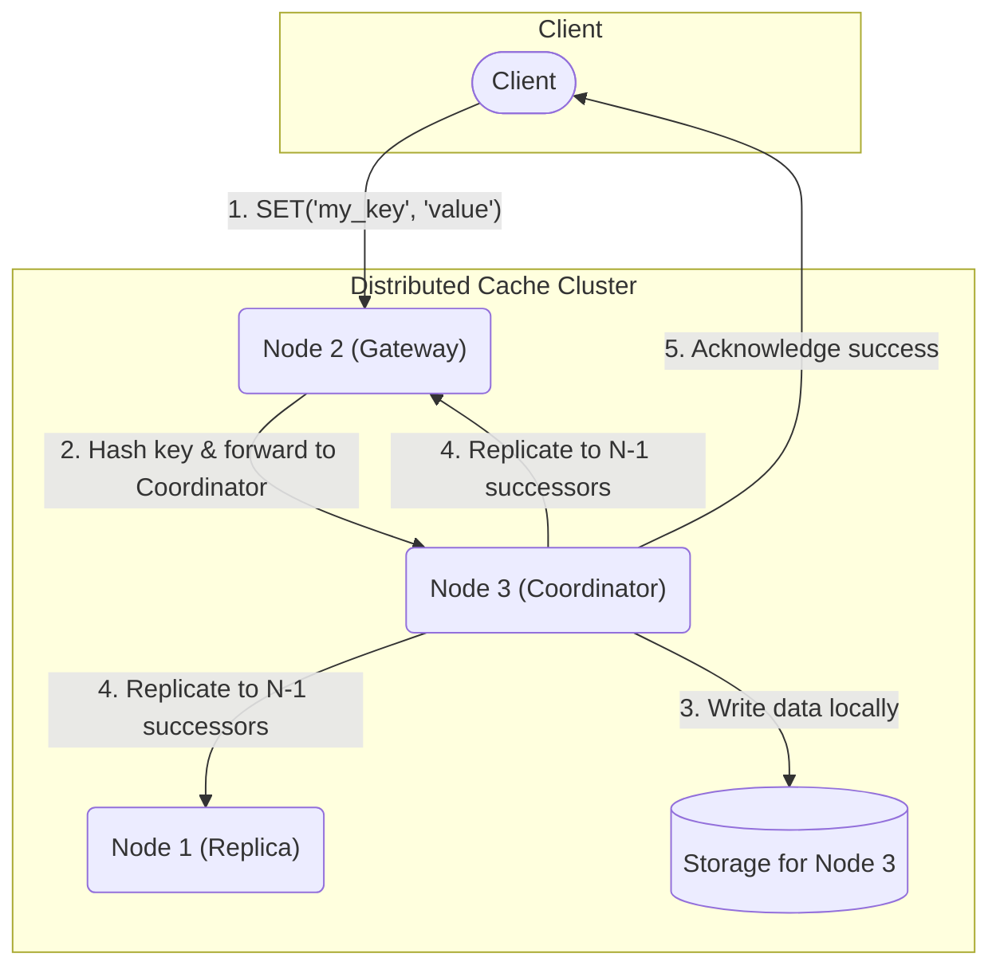

# Python Distributed Key-Value Store

After researching foundational distributed systems like Amazon's DynamoDB and Redis Cluster, I wanted to move beyond theory and implement the core principles of resilience and scale myself. This project is the result: a **fault-tolerant key-value store built from scratch** to explore how systems can guarantee data safety in the face of network and server failures.

The system operates as a cluster of nodes that partition data using consistent hashing, replicate every write for high availability, and communicate using high-performance gRPC. Its resilience is validated by an automated chaos test that proves it can withstand sudden node outages with zero data loss.

## Key Features

- **Distributed & Fault-Tolerant**: Uses N-way replication to ensure data safety and high availability
- **Asynchronous Architecture**: Built on Python's asyncio to handle thousands of concurrent client connections with high throughput
- **Algorithmic Partitioning**: Implements a consistent hashing ring from scratch to intelligently distribute data across the cluster
- **High-Performance Networking**: Uses gRPC and Protocol Buffers for a strongly-typed API contract and low-latency internal communication
- **Proven Resilience**: Includes an automated "chaos test" that terminates live nodes to definitively prove the system's fault tolerance
- **Fully Containerized**: The entire multi-node cluster is defined and orchestrated with Docker and Docker Compose for one-command deployment

## System Architecture: The Distributed Algorithm

The system's resilience is based on two core distributed algorithms: **Consistent Hashing** for data partitioning and **N-way Replication** for fault tolerance.

### How It Works

- **Consistent Hashing**: Physical server nodes are mapped to many points ("virtual nodes") on a logical ring. A key is hashed to a point on the same ring. The physical node clockwise from that point is the "coordinator" for that key.
- **Routing**: A request sent to any node will be forwarded to the correct coordinator based on the hash ring logic.
- **Replication**: The coordinator replicates the write to the next N-1 successor nodes on the ring to ensure data safety.

### Architecture Diagram



## Benchmark & Resilience Analysis

### Benchmark Environment

All benchmarks were executed on the following developer-grade machine to ensure reproducibility:

- **CPU**: 12th Gen Intel(R) Core(TM) i7-12700H
- **RAM**: 16 GB
- **Storage**: NVMe SSD
- **OS**: Windows 11 Home (WSL2 Ubuntu 22.04)
- **Network**: Docker Compose bridge network

### Performance Results

Benchmarks were run against a 3-node cluster, simulating a high-concurrency workload of 50 simultaneous clients.

| Metric | Result | Analysis |
|--------|--------|----------|
| GET Throughput | ~17,000 ops/sec | Demonstrates the efficiency of the asyncio architecture for I/O-bound workloads |
| GET Latency (p99) | < 6 ms | Shows 99% of read requests completed in under 6ms, even under heavy concurrent load |
| SET Throughput | ~3,500 ops/sec | Reflects the necessary trade-off for fault tolerance, as each SET is coordinated and replicated |

## Proof of Fault Tolerance: The Chaos Test

The system's fault tolerance was validated via an automated chaos test that simulates a catastrophic node failure.

### Test Phases

**(A) Stable Performance**: The cluster operates with low latency.

**(B) Catastrophic Failure**: The moment a node is killed, latency briefly spikes as in-flight requests are retried against surviving nodes.

**(C) Stable Recovery**: The cluster immediately recovers, routing all new requests to the two surviving nodes, and settles into a new, stable latency profile, proving zero data loss and high availability.

**Note**: To view the actual graph, run the `chaos_test.py` script, which generates latency data.

## Getting Started

### Prerequisites

- Docker & Docker Compose
- Git
- Python 3.10+ (for running test scripts)

### 1. Launch the 3-Node Cluster

Clone the repository and use Docker Compose to build and start the services:

```bash
git clone https://github.com/YourUsername/python-distributed-cache.git
cd python-distributed-cache
docker-compose up --build
```

The cluster is now running.

### 2. Run the Fault Tolerance (Chaos) Test

While the cluster is running, open a second terminal to run the chaos test:

```bash
# In a new terminal, from the project root
python3 -m venv venv
source venv/bin/activate
pip install -r requirements.txt

python chaos_test.py
```

Upon successful completion, you will see a `✅ CHAOS TEST PASSED ✅` message and the data for the graph will be generated.

### 3. Run the Performance Benchmark

To run the performance benchmark against the live cluster:

```bash
# In a new terminal, with the venv activated
python benchmark.py
```

## License
sfsfsffs
This project is provided as-is for educational and demonstration purposes.ddssd
