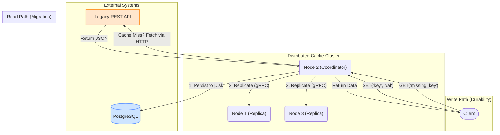

# Python Distributed Key-Value Store

After researching foundational distributed systems like Amazon's DynamoDB and Redis Cluster, I wanted to move beyond theory and implement the core principles of resilience and scale myself. This project is one of the attempts, **fault-tolerant key-value store built from scratch** to explore how systems can guarantee data safety in the face of network and server failures.

The system operates as a peer-to-peer cluster that partitions data using **consistent hashing** and replicates every write for **high availability**. It now includes **write-through persistence** to PostgreSQL and a **read-through fallback** to legacy APIs, simulating a real-world system migration scenario.

## Key Features

-   **Legacy System Bridge (New)**: Implements a **read-through caching** strategy. If a key is not found in the cluster, the system automatically queries a simulated **Legacy REST API** via HTTP/JSON to fetch and hydrate the data, ensuring zero downtime for users during migrations.
-   **Durable Persistence (New)**: Uses a **write-through** strategy to persist all data to a **PostgreSQL** database using `asyncpg`. This guarantees data safety even if the entire cluster loses power.
-   **Distributed & Fault-Tolerant**: Uses N-way replication (N=3) to ensure data safety. Resilience is verified by automated chaos tests that terminate live nodes during operation without data loss.
-   **High-Performance & Asynchronous**: Built on Python's `asyncio` and `gRPC` to handle thousands of concurrent operations with low latency.
-   **Algorithmic Partitioning**: Implements a consistent hashing ring from scratch to intelligently and dynamically distribute data across the cluster.

## System Architecture

The system is a leaderless, peer-to-peer distributed system. Every node can serve any client request, acting as a coordinator for that specific request.

1.  **Consistent Hashing**: Determines which node owns a key to minimize data reshuffling.
2.  **N-Way Replication**: Replicates data acros N nodes in parallel.
3.  **Migration Logic**:
    *   **Write Path**: Writes are committed to the **PostgreSQL** database immediately for durability.
    *   **Read Path**: Cache misses trigger an asynchronous HTTP call to the **Legacy API**. If found, the data is returned to the client and populated into the cache.

### Architecture Diagram


## Benchmark & Resilience Analysis

### Benchmark Environment

All benchmarks were executed on the following developer-grade machine to ensure reproducibility:

- **CPU**: 12th Gen Intel(R) Core(TM) i7-12700H
- **RAM**: 16 GB
- **Storage**: NVMe SSD
- **OS**: Windows 11 Home (WSL2 Ubuntu 22.04)
- **Network**: Docker Compose bridge network


## Performance & Resilience

Benchmarks were run against a 3-node cluster running in Docker containers, simulating a high-concurrency workload.

| Metric            | Result            | Analysis                                                                     |
| ----------------- | ----------------- | ---------------------------------------------------------------------------- |
| GET Throughput    | **~4,800 ops/sec**| High throughput maintained even with the overhead of the new `httpx` fallback logic.      |
| Fault Tolerance   | **Zero Data Loss**| Verified by `chaos_test.py` which violently terminates live container nodes during active operations. |
| Persistence       | **100% Durability**| Verified via direct SQL queries to the underlying **PostgreSQL** storage engine, ensuring data survives cluster restarts. |

## Getting Started

The project is fully containerized. You can spin up the entire architecture (Cache Cluster, Legacy API, PostgreSQL) using Docker Compose.

### 1. Setup & Launch
```bash
# Install dependencies for the test scripts
pip install -r requirements.txt

# Build and start the cluster
docker-compose up -d --build
```

### 2. Verify Key Features
Run the following scripts to validate the specific architectural claims made in the documentation.

**Test A: Fault Tolerance (Chaos Engineering)**
Simulates a catastrophic node failure by killing a container while the system is running. Verifies that data remains accessible via replication.
```bash
python chaos_test.py
# Expected Output: "✅ CHAOS TEST PASSED ✅"
```

**Test B: Legacy System Migration (Read-Through)**
Verifies the "Read-Through" capability. Queries a key that does *not* exist in the cache but *does* exist in the Legacy REST API.
```bash
python test_legacy.py
# Expected Output: "✅ SUCCESS: Fetched data from Legacy API!"
```

**Test C: Database Persistence (Write-Through)**
Verifies that data is being persisted to the PostgreSQL database in real-time.
```bash
# 1. Write data to the cache
python client.py

# 2. Check the database directly
docker exec -it postgres_db psql -U admin -d cache_db -c "SELECT key, created_at FROM kv_store;"
# Expected Output: You should see 'my_special_key' listed in the SQL table.
```

## License

This project is licensed under the MIT License.
