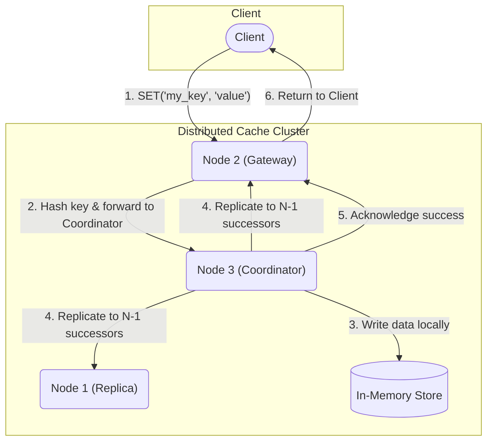

# Python Distributed Key-Value Store

This project is a **fault-tolerant, distributed key-value store built from scratch in Python**. It was created to move beyond theory and implement the core principles of resilience and scale that power systems like Amazon's DynamoDB.

The system operates as a peer-to-peer cluster that partitions data using **consistent hashing** and replicates every write for **high availability**. Originally built for Docker Compose, the system has been re-architected for a cloud-native environment, now running on **Kubernetes** with built-in self-healing and a full **observability stack** for performance monitoring.

## Key Features

- **Cloud-Native & Self-Healing**: Deployed on **Kubernetes** using `StatefulSets`. With Liveness/Readiness probes, the cluster can automatically detect and replace failed nodes with zero manual intervention.
- **Distributed & Fault-Tolerant**: Uses N-way replication to ensure data safety. Resilience is proven by an automated chaos test that validates zero data loss during catastrophic node failures.
- **High-Performance & Asynchronous**: Built on Python's `asyncio` and `gRPC` to handle thousands of concurrent operations with low latency.
- **Deeply Observable**: Instrumented with **OpenTelemetry**. Distributed traces are exported to **Jaeger**, allowing for end-to-end request lifecycle analysis to pinpoint latency bottlenecks.
- **Algorithmic Partitioning**: Implements a consistent hashing ring from scratch to intelligently and dynamically distribute data across the cluster.

## System Architecture

The system is a leaderless, peer-to-peer distributed system. Every node can serve any client request, acting as a coordinator for that specific request. Resilience is achieved through two core algorithms:

1.  **Consistent Hashing**: To determine which node is responsible for a key, the system uses a consistent hashing algorithm. This minimizes data reshuffling when nodes are added or removed, enabling horizontal scalability.
2.  **N-Way Replication**: To ensure data safety, every piece of data is replicated across N nodes (default N=3). When a node receives a write, it is responsible for writing the data locally and sending replication requests to the other N-1 nodes in parallel.

### Architecture Diagram



## Performance & Resilience

Benchmarks were run against a 3-node Kubernetes cluster, simulating a high-concurrency workload of 50 simultaneous clients. The specificaiotns were of a commodity hardware: an Intel i7-12700H (14C/20T) processor, 16GB DDR4 RAM, and a PCIe Gen 4.0 NVMe SSD, all within a WSL2 Ubuntu 22.04 .

| Metric            | Result            | Analysis                                                                     |
| ----------------- | ----------------- | ---------------------------------------------------------------------------- |
| GET Throughput    | ~17,000 ops/sec   | Demonstrates the efficiency of the `asyncio` architecture for I/O-bound tasks. |
| GET Latency (p99) | < 6 ms            | 99% of read requests completed in under 6ms, even under heavy concurrent load.   |
| Fault Tolerance   | Zero Data Loss    | Verified by automated chaos tests that terminate live pods during operation.     |

## Getting Started (Kubernetes)

### Prerequisites

-   Docker (or another container runtime)
-   `kubectl` (Kubernetes CLI)
-   `k3d` (for creating a local cluster)
-   Python 3.10+ & `venv`

### 1. Launch the Kubernetes Cluster

First, create a local Kubernetes cluster using `k3d`:
```bash
k3d cluster create cache-cluster
```

### 2. Build and Deploy the Cache System

This project is designed to run without an external Docker Hub account.

```bash
# In your project root
# 1. Build the Docker image
docker build -t my-cache-image:local .

# 2. Import the image into your k3d cluster
k3d image import my-cache-image:local --cluster cache-cluster

# 3. Deploy the cache service and its observability backend (Jaeger, OTel)
kubectl apply -f service.yaml -f statefulset.yaml
kubectl apply -f collector.yaml -f jaeger.yaml
```

After a minute, verify that all pods are running:
```bash
kubectl get pods
# You should see 3 'cache-node' pods, 1 'jaeger' pod, and 1 'otel-collector' pod.
```

### 3. Run a Benchmark and View Traces

To interact with the cluster and generate performance data, we use `kubectl port-forward` to create secure tunnels from your local machine into the cluster.

**Open 3 separate terminals and run one command in each:**

```bash
# Terminal 1: Forward Jaeger UI
kubectl port-forward service/jaeger-service 16686:16686

# Terminal 2: Forward OTel Collector
kubectl port-forward service/otel-collector-service 4317:4317

# Terminal 3: Forward gRPC traffic to one cache node
kubectl port-forward pod/cache-node-0 50051:50051
```

**In a 4th terminal, run the benchmark:**

```bash
# Set up Python environment
python3 -m venv venv
source venv/bin/activate
pip install -r requirements.txt

# Run the benchmark
python benchmark.py
```

-   **To see the traces:** Open your browser to `http://localhost:16686`.
-   Select the `cache-service` and click "Find Traces".

### 4. Demonstrate Self-Healing

While watching the pods in one terminal (`kubectl get pods -w`), delete a pod in another:```bash
kubectl delete pod cache-node-1
```
You will see Kubernetes automatically terminate the old pod and create a new, healthy one to take its place.
